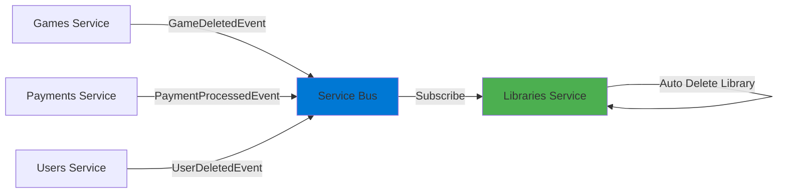
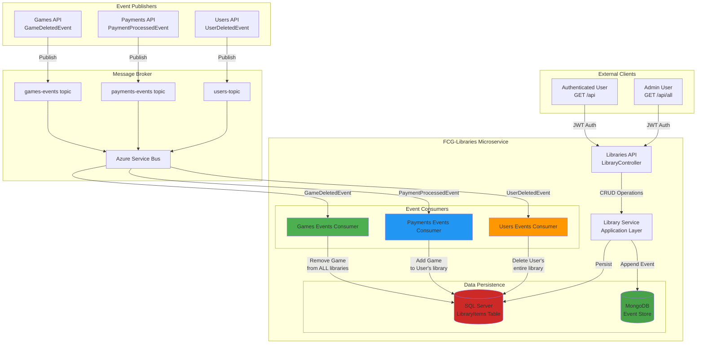
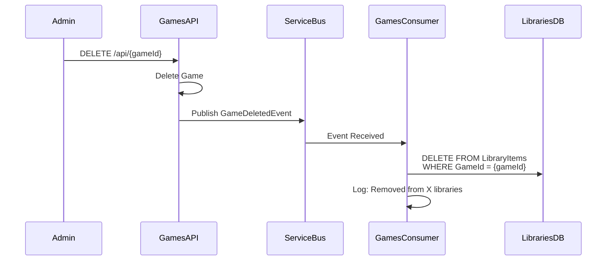
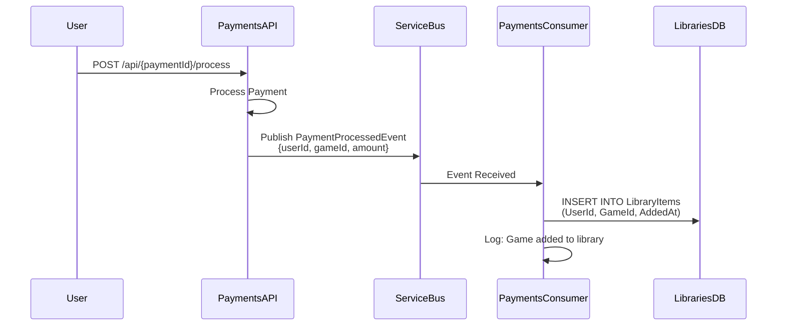

# 📚 FCG-Libraries - Game Library Management Service

> **Microsserviço de Bibliotecas** - Gerenciamento de bibliotecas de jogos com sincronização cross-service via eventos

[](https://dotnet.microsoft.com/)
[](https://blog.cleancoder.com/uncle-bob/2012/08/13/the-clean-architecture.html)
[](https://martinfowler.com/articles/201701-event-driven.html)
[](https://martinfowler.com/bliki/DomainDrivenDesign.html)
[](https://microservices.io/patterns/data/saga.html)

## 🎯 O que é este projeto?

**FCG-Libraries** é o **microsserviço de gerenciamento de bibliotecas de jogos** que orquestra a coleção de games de cada usuário. Demonstra **arquitetura orientada a eventos**, **sincronização distribuída** e **consistência eventual** através de **choreography pattern**, reagindo automaticamente a eventos de Users, Games e Payments.

### Responsabilidades Principais
- ✅ Gerenciamento de bibliotecas pessoais (games por usuário)
- ✅ Adição/remoção de jogos na biblioteca
- ✅ **Sincronização automática cross-service**:
  - Quando um **Game é deletado** → Remove de TODAS as bibliotecas
  - Quando um **Pagamento é processado** → Adiciona game à biblioteca do usuário
  - Quando um **Usuário é deletado** → Remove TODA sua biblioteca
- ✅ Autorização: usuários comuns acessam apenas sua biblioteca, admins veem todas
- ✅ Event Sourcing: histórico completo de alterações em bibliotecas

---

## 🚀 Tecnologias e Padrões Aplicados

### Stack Técnico Completo
| Tecnologia | Propósito | Conceito Aplicado |
|------------|-----------|-------------------|
| **ASP.NET Core 8** | Web API Framework | RESTful API, Middleware |
| **Entity Framework Core 8** | ORM | Code-First, Foreign Keys, Cascade |
| **SQL Server** | Banco Relacional | Persistência com relacionamentos |
| **MongoDB (Cosmos DB)** | NoSQL Document Store | Event Store (audit trail) |
| **Azure Service Bus** | Message Broker | Multi-topic subscriptions |
| **AutoMapper** | Object Mapping | DTO ↔ Entity transformation |
| **FluentValidation** | Validação | Regras de negócio declarativas |
| **Swagger/Swashbuckle** | API Documentation | OpenAPI 3.0 |
| **Docker** | Containerização | Deployment consistency |

### Padrões Arquiteturais Implementados

#### 🏗️ **Clean Architecture (Onion Architecture)**
```
┌─────────────────────────────────────┐
│   API Layer (LibraryController)     │  ← Apresentação
├─────────────────────────────────────┤
│ Application Layer (LibraryService)  │  ← Casos de Uso
├─────────────────────────────────────┤
│ Domain Layer (LibraryItem Entity)   │  ← Lógica de Negócio
├─────────────────────────────────────┤
│Infrastructure (EF, Service Bus)     │  ← Detalhes Técnicos
└─────────────────────────────────────┘
```

#### 📊 **Domain-Driven Design (DDD)**
- **Aggregates**: Library (coleção de LibraryItems)
- **Entities**: LibraryItem com relacionamentos para User e Game
- **Domain Events**: LibraryItemCreatedEvent, LibraryItemDeletedEvent
- **Repositories**: Abstração de persistência
- **Anti-Corruption Layer**: Eventos externos traduzidos para domain events

#### 🔄 **Event-Driven Architecture (EDA) - Choreography**


**Choreography vs Orchestration**:
- ❌ **Sem orquestrador central** (cada serviço reage independentemente)
- ✅ **Acoplamento mínimo** (serviços não se conhecem diretamente)
- ✅ **Escalabilidade** (cada serviço escala independentemente)

#### 🎭 **Saga Pattern (Choreography-Based)**
Transações distribuídas sem coordenador central:
```
Pagamento Aprovado → Libraries adiciona game → Se falhar, publica CompensationEvent
```

#### 🔐 **Authorization Patterns**
- **Resource-Based Authorization**: Usuários acessam apenas SUA biblioteca
- **Policy-Based Authorization**: Admins acessam TODAS as bibliotecas
- **Claims-Based**: Extração de UserId do JWT para filtragem

---

## 📐 Estrutura do Projeto

```
FCG-Libraries/
├── FCG-Libraries.Api/             # Controllers, Middleware
│   ├── Controllers/
│   │   └── LibraryController.cs   # Endpoints REST
│   └── Program.cs                 # DI Container, JWT Config
│
├── FCG-Libraries.Application/     # Casos de Uso, DTOs
│   ├── DTOs/
│   │   ├── CreateLibraryItemRequest.dto.cs
│   │   └── LibraryItemResponse.dto.cs
│   ├── Services/
│   │   └── LibraryService.cs      # Lógica de aplicação
│   └── Validators/
│       └── CreateLibraryItemValidator.cs
│
├── FCG-Libraries.Domain/          # Entidades, Interfaces
│   ├── Entities/
│   │   ├── LibraryItem.cs         # Entity
│   │   └── Library.cs             # Aggregate (coleção)
│   ├── Events/
│   │   ├── LibraryItemCreatedEvent.cs
│   │   └── LibraryItemDeletedEvent.cs
│   └── Interfaces/
│       └── ILibraryRepository.cs
│
├── FCG-Libraries.Infrastructure/  # EF Core, Service Bus, MongoDB
│   ├── Data/
│   │   ├── AppDbContext.cs
│   │   └── Migrations/
│   ├── Repositories/
│   │   └── LibraryRepository.cs
│   ├── EventStore/
│   │   └── MongoEventStore.cs
│   └── Messaging/
│       └── ServiceBusPublisher.cs
│
└── FCG-Libraries.Consumer/        # Background Service (Multi-topic)
    └── Workers/
        ├── GamesEventsConsumer.cs     # Reage a GameDeletedEvent
        ├── PaymentsEventsConsumer.cs  # Reage a PaymentProcessedEvent
        └── UsersEventsConsumer.cs     # Reage a UserDeletedEvent
```

---

## ⚙️ Configuração e Execução

### Pré-requisitos
- .NET 8 SDK
- SQL Server (local ou Azure)
- MongoDB (local, Docker ou Cosmos DB)
- Azure Service Bus namespace (3 topics subscription)
- JWT Key (compartilhada com FCG-Users)

### Configuração (appsettings.json)

```json
{
  "ConnectionStrings": {
    "DefaultConnection": "Server=localhost;Database=LibrariesDb;Trusted_Connection=True;"
  },
  "ServiceBus": {
    "ConnectionString": "<service-bus-connection-string>",
    "Topics": {
      "Libraries": "libraries-events"
    },
    "Subscriptions": {
      "Games": "games-subscription",
      "Payments": "payments-subscription",
      "Users": "users-subscription"
    }
  },
  "MongoSettings": {
    "ConnectionString": "mongodb://localhost:27017",
    "Database": "EventStoreDb",
    "Collection": "Events"
  },
  "Jwt": {
    "Key": "9y4XJg0aTphzFJw3TvksRvqHXd+Q4VB8f7ZvU08N+9Q=",
    "Issuer": "FGC-Users",
    "Audience": "API"
  },
  "Services": {
    "GamesApi": "https://localhost:7002",
    "UsersApi": "https://localhost:7001"
  }
}
```

### Executar Migrations
```powershell
cd FCG-Libraries.Api
dotnet ef database update
```

### Executar API
```powershell
cd FCG-Libraries.Api
dotnet run
# API disponível em: https://localhost:7004
```

### Executar Consumer (Multi-topic)
```powershell
cd FCG-Libraries.Consumer
dotnet run
# Consome eventos de: games-events, payments-events, users-topic
```

---

## 🔐 Endpoints e Autorização

### Matriz de Autorização

| Método | Endpoint | Autorização | Descrição |
|--------|----------|-------------|-----------|
| GET | `/api` | [Authorize] | Listar biblioteca do usuário autenticado |
| GET | `/api/all` | [Authorize(Roles="Admin")] | Listar TODAS as bibliotecas (Admin only) |
| GET | `/api/{id}` | [Authorize] | Obter item por ID (apenas do próprio usuário) |
| POST | `/api` | [Authorize] | Adicionar jogo à biblioteca |
| PUT | `/api/{id}` | [Authorize] | Atualizar item (favorito, instalado, etc) |
| DELETE | `/api/{id}` | [Authorize(Roles="Admin")] | Remover item da biblioteca |

### Resource-Based Authorization (Código)
```csharp
[HttpGet]
public async Task<IActionResult> GetMyLibrary()
{
    // Extrai UserId do JWT claims
    var userId = Guid.Parse(User.FindFirst(ClaimTypes.NameIdentifier)!.Value);
    
    var library = await _service.GetLibraryByUserIdAsync(userId);
    return Ok(library);
}

[HttpGet("all")]
[Authorize(Roles = "Admin")]
public async Task<IActionResult> GetAllLibraries()
{
    // Apenas admins podem listar TODAS as bibliotecas
    var libraries = await _service.GetAllLibrariesAsync();
    return Ok(libraries);
}
```

### Exemplo de Request (Adicionar Jogo)

**Obter token JWT**:
```bash
curl -X POST https://localhost:7001/api/auth \
  -H "Content-Type: application/json" \
  -d '{"email": "user@fcg.com", "password": "Senha@123"}'
```

**Adicionar jogo à biblioteca**:
```bash
curl -X POST https://localhost:7004/api \
  -H "Authorization: Bearer <token>" \
  -H "Content-Type: application/json" \
  -d '{
    "gameId": "7b8c9d0e-1f2a-3b4c-5d6e-7f8a9b0c1d2e",
    "isFavorite": false,
    "isInstalled": false
  }'
```

**Response**:
```json
{
  "id": "a1b2c3d4-e5f6-7g8h-9i0j-k1l2m3n4o5p6",
  "userId": "3fa85f64-5717-4562-b3fc-2c963f66afa6",
  "gameId": "7b8c9d0e-1f2a-3b4c-5d6e-7f8a9b0c1d2e",
  "gameName": "The Witcher 3",
  "isFavorite": false,
  "isInstalled": false,
  "addedAt": "2026-01-09T10:00:00Z"
}
```

---

## 🏛️ Arquitetura - Diagrama Mermaid



---

## 🔄 Fluxos de Sincronização - Sequence Diagrams

### Cenário 1: Game Deletado (Cross-Service Sync)



**Resultado**: Game deletado automaticamente de TODAS as bibliotecas (milhares de usuários em 1 evento)!

### Cenário 2: Pagamento Processado (Auto-Add)



**Resultado**: Após compra, jogo aparece automaticamente na biblioteca do usuário!

---

## 🧪 Padrões de Código Demonstrados

### Consumer Multi-Topic (Background Service)
```csharp
public class PaymentsEventsConsumer : BackgroundService
{
    private readonly ServiceBusClient _client;
    private readonly IServiceProvider _serviceProvider;
    
    protected override async Task ExecuteAsync(CancellationToken stoppingToken)
    {
        var processor = _client.CreateProcessor("payments-events", "libraries-subscription");
        
        processor.ProcessMessageAsync += async args =>
        {
            var @event = JsonSerializer.Deserialize<PaymentProcessedEvent>(args.Message.Body);
            
            using var scope = _serviceProvider.CreateScope();
            var service = scope.ServiceProvider.GetRequiredService<ILibraryService>();
            
            // Auto-adicionar game à biblioteca após pagamento
            await service.AddGameToLibraryAsync(@event.UserId, @event.GameId);
            
            await args.CompleteMessageAsync(args.Message);
        };
        
        await processor.StartProcessingAsync(stoppingToken);
    }
}
```

### Cascade Delete (Game Removed from All Libraries)
```csharp
public async Task HandleGameDeletedEventAsync(GameDeletedEvent @event)
{
    // Remove game de TODAS as bibliotecas
    var itemsToRemove = await _context.LibraryItems
        .Where(item => item.GameId == @event.GameId)
        .ToListAsync();
    
    _context.LibraryItems.RemoveRange(itemsToRemove);
    await _context.SaveChangesAsync();
    
    _logger.LogInformation(
        "Game removido de {Count} bibliotecas | GameId: {GameId}",
        itemsToRemove.Count,
        @event.GameId
    );
    
    // Append evento no Event Store
    await _eventStore.AppendAsync("games-cascade", 0, new LibraryItemsBulkDeletedEvent
    {
        GameId = @event.GameId,
        AffectedLibraries = itemsToRemove.Count,
        DeletedAt = DateTime.UtcNow
    });
}
```

---

## 📊 Observabilidade

### Logs Estruturados
```csharp
_logger.LogInformation(
    "Jogo adicionado à biblioteca | UserId: {UserId} | GameId: {GameId} | Source: {Source} | CorrelationId: {CorrelationId}",
    userId,
    gameId,
    "PaymentProcessedEvent",
    correlationId
);
```

### Métricas Importantes
- Número de bibliotecas por usuário (média/mediana)
- Taxa de sincronização cross-service (success rate)
- Latência entre evento publicado e processado
- Dead Letter Messages (eventos não processados)

---

## 🎓 Conceitos Avançados Demonstrados

### **Eventual Consistency**
Bibliotecas sincronizam-se **eventualmente** com Games/Payments/Users:
- ⏱️ Latência: ~100-500ms entre evento e sincronização
- ✅ Garantia: Todos os consumidores processarão o evento (at-least-once delivery)

### **Idempotency**
Eventos duplicados não causam problemas:
```csharp
// Verificar se jogo já existe antes de adicionar
var exists = await _context.LibraryItems
    .AnyAsync(item => item.UserId == userId && item.GameId == gameId);

if (!exists)
    await _context.LibraryItems.AddAsync(new LibraryItem { ... });
```

### **Compensating Transactions**
Se adição falhar, publica evento de compensação:
```csharp
try
{
    await AddGameToLibraryAsync(userId, gameId);
}
catch (Exception ex)
{
    await _publisher.PublishAsync(new LibraryItemCreationFailedEvent
    {
        UserId = userId,
        GameId = gameId,
        Reason = ex.Message
    });
}
```

### **Anti-Corruption Layer**
Eventos externos traduzidos para eventos de domínio:
```
PaymentProcessedEvent (externo) → LibraryItemCreatedEvent (domínio)
```

---

## 📚 Referências Técnicas

- [Saga Pattern - Choreography (Chris Richardson)](https://microservices.io/patterns/data/saga.html)
- [Event-Driven Architecture (Martin Fowler)](https://martinfowler.com/articles/201701-event-driven.html)
- [Clean Architecture (Uncle Bob)](https://blog.cleancoder.com/uncle-bob/2012/08/13/the-clean-architecture.html)
- [Eventual Consistency (Werner Vogels)](https://www.allthingsdistributed.com/2008/12/eventually_consistent.html)
- [DDD Reference (Eric Evans)](https://www.domainlanguage.com/ddd/reference/)

## SEO
.NET 8, C#, Clean Architecture, Onion Architecture, DDD, CQRS, Azure Service Bus, EF Core 8, Entity Framework, SQL Server, Dependency Injection, BackgroundService, Worker Service, Microservices, Azure, DevOps, GitHub, Portfolio, REST API, Messaging, Asynchronous Processing, Repository Pattern
